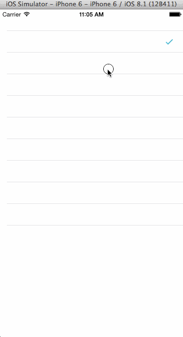
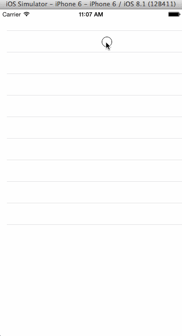

HaidoraCheckView
================

a custom CheckView

###Features
* Radio / Multiple Choice

###Supports
* iOS6 Later
* ARC

###Installation
Available in [HaidoraPods](https://github.com/Haidora/HaidoraPods)

```
pod 'HaidoraCheckView'
```
###How to use

```
HDCheckView *checkView =[HDCheckView new];//or xib
//set Radio/Multiple Choice
checkView.multipleCheck = YES;
```
* multipleCheck = YES



* multipleCheck = NO




